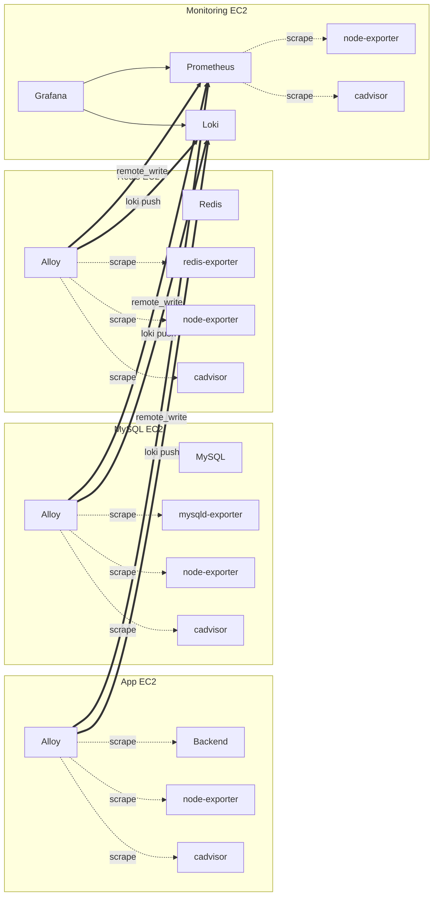

# V1 모니터링 & 통신 구조 분석

## 개요

V1 인프라의 모니터링 수집 방식, 인스턴스 간 통신 경로, 컴포넌트 역할을 정리한 문서다.

## EC2 인스턴스 구성

| EC2 | 역할 | 주요 컨테이너 |
|---|---|---|
| App | 애플리케이션 서빙 | Nginx, Backend, Frontend, node-exporter, cadvisor, Alloy |
| MySQL | 데이터베이스 | MySQL, mysqld-exporter, node-exporter, cadvisor, Alloy |
| Redis | 캐시 | Redis, redis-exporter, node-exporter, cadvisor, Alloy |
| Monitoring | 관측 중앙 서버 | Prometheus, Grafana, Loki, node-exporter, cadvisor |

## 컴포넌트 역할 정리

### Exporter (메트릭 생산자)

| 컴포넌트 | 역할 | 포트 |
|---|---|---|
| node-exporter | 호스트 메트릭 (CPU, 메모리, 디스크, 네트워크) | 9100 |
| cadvisor | 컨테이너 메트릭 (컨테이너별 CPU/메모리/네트워크) | 8080 |
| mysqld-exporter | MySQL 메트릭 (쿼리, 커넥션, InnoDB 등) | 9104 |
| redis-exporter | Redis 메트릭 (메모리, 명령, 키 등) | 9121 |

### Alloy (수집 에이전트)

- 각 EC2에서 로컬 exporter를 **스크래핑**
- 수집한 메트릭을 Monitoring EC2의 Prometheus로 **remote_write**
- Docker 컨테이너 로그를 Monitoring EC2의 Loki로 **push**
- Alloy 자체는 메트릭을 생산하지 않음 (exporter가 필요)

### node-exporter가 필요한 이유

Alloy는 메트릭 **전송자**이지 **생산자**가 아니다. Alloy config에서 node-exporter를 스크래핑하고 있으므로 node-exporter 없이는 호스트 메트릭 수집이 불가능하다.

```
[node-exporter] --9100--> [Alloy scrape] --remote_write--> [Prometheus]
[cadvisor]      --8080--> [Alloy scrape] --remote_write--> [Prometheus]
```

참고: Alloy의 `prometheus.exporter.unix` 빌트인을 사용하면 node-exporter 대체가 가능하지만, Docker 컨테이너 내에서 호스트 메트릭을 정확히 수집하려면 추가 볼륨/권한 설정이 필요하다. 현재 별도 node-exporter를 사용하는 구조가 더 안정적이다.

## 수집 방식: Push 기반 아키텍처

### 핵심 흐름



### 통신 경로 요약

| 출발 | 도착 | 포트 | 프로토콜 | 용도 |
|---|---|---|---|---|
| App Alloy | Monitoring Prometheus | 9090 | HTTP (remote_write) | 메트릭 push |
| App Alloy | Monitoring Loki | 3100 | HTTP (push) | 로그 push |
| MySQL Alloy | Monitoring Prometheus | 9090 | HTTP (remote_write) | 메트릭 push |
| MySQL Alloy | Monitoring Loki | 3100 | HTTP (push) | 로그 push |
| Redis Alloy | Monitoring Prometheus | 9090 | HTTP (remote_write) | 메트릭 push |
| Redis Alloy | Monitoring Loki | 3100 | HTTP (push) | 로그 push |
| Monitoring Prometheus | 로컬 node-exporter | 9100 | HTTP (scrape) | 자체 호스트 메트릭 |
| Monitoring Prometheus | 로컬 cadvisor | 8080 | HTTP (scrape) | 자체 컨테이너 메트릭 |

### 수집 대상별 정리

| EC2 | 메트릭 수집 방식 | 로그 수집 방식 |
|---|---|---|
| App | Alloy → remote_write → Prometheus | Alloy → push → Loki |
| MySQL | Alloy → remote_write → Prometheus | Alloy → push → Loki |
| Redis | Alloy → remote_write → Prometheus | Alloy → push → Loki |
| Monitoring | Prometheus 로컬 scrape | 수집 안 함 (Alloy 미설치) |

## Security Group 경로 점검

### 정상 사용 중인 SG Rule

| Rule | SG | 용도 |
|---|---|---|
| App SG → Monitoring SG (9090) | `monitoring_prometheus_from_app` | Alloy remote_write |
| App SG → Monitoring SG (3100) | `monitoring_loki_from_app` | Alloy 로그 push |
| DB SG → Monitoring SG (9090) | `monitoring_prometheus_from_db` | Alloy remote_write |
| DB SG → Monitoring SG (3100) | `monitoring_loki_from_db` | Alloy 로그 push |

### 미사용 SG Rule (정리 후보)

| Rule | SG | 비고 |
|---|---|---|
| Monitoring SG → App SG (9100) | `app_node_exporter_from_monitoring` | Prometheus가 App을 pull하지 않음 |
| Monitoring SG → App SG (8080) | `app_cadvisor_from_monitoring` | Prometheus가 App을 pull하지 않음 |

이 두 규칙은 Monitoring에서 App EC2를 직접 스크래핑(pull)할 때 필요하지만, 현재는 push 방식이므로 사용되지 않는다. 향후 pull 방식을 추가할 계획이 없다면 제거 가능하다.

## 필수 환경변수

각 EC2의 Alloy가 Monitoring EC2로 정상 전송하려면 다음 환경변수가 정확히 설정되어야 한다.

### App EC2 (alloy.env)

| 변수 | 예시 | 설명 |
|---|---|---|
| `ALLOY_SPRING_TARGET` | `backend:8080` | Spring Boot 메트릭 엔드포인트 |
| `ALLOY_INSTANCE` | `app` | 인스턴스 식별 라벨 |
| `PROM_REMOTE_WRITE_URL` | `http://<MONITORING_PRIVATE_IP>:9090/api/v1/write` | Prometheus remote write |
| `LOKI_WRITE_URL` | `http://<MONITORING_PRIVATE_IP>:3100/loki/api/v1/push` | Loki push |
| `ALLOY_LOG_PATH_GLOB` | `/var/lib/docker/containers/*/*.log` | Docker 로그 경로 |

### MySQL EC2 / Redis EC2 (.env)

| 변수 | 설명 |
|---|---|
| `ALLOY_INSTANCE` | 인스턴스 식별 라벨 (`mysql`, `redis`) |
| `PROM_REMOTE_WRITE_URL` | Prometheus remote write URL |
| `LOKI_WRITE_URL` | Loki push URL |
| `ALLOY_LOG_PATH_GLOB` | Docker 로그 경로 |

## 운영 점검 체크리스트

### 메트릭 수집 확인

```bash
# Monitoring EC2에서 - 각 인스턴스 메트릭이 들어오는지 확인
curl -s "http://localhost:9090/api/v1/query?query=up" | jq '.data.result[] | {instance: .metric.instance, job: .metric.job, value: .value[1]}'

# 기대 결과: app/mysql/redis 인스턴스별로 node-exporter, cadvisor, spring-backend, mysql, redis job이 보여야 함
```

### 로그 수집 확인

```bash
# Monitoring EC2에서 - Loki에 로그가 들어오는지 확인
curl -s "http://localhost:3100/loki/api/v1/labels" | jq
```

### 각 EC2에서 Alloy → Monitoring 연결 확인

```bash
# 각 EC2에서 실행
curl -sS -o /dev/null -w "%{http_code}\n" http://<MONITORING_PRIVATE_IP>:9090/-/ready
curl -sS -o /dev/null -w "%{http_code}\n" http://<MONITORING_PRIVATE_IP>:3100/ready
# 둘 다 200이면 정상
```

### Alloy 상태 확인

```bash
# 각 EC2에서 Alloy UI 확인
curl -sS -o /dev/null -w "%{http_code}\n" http://localhost:12345/-/ready
```
