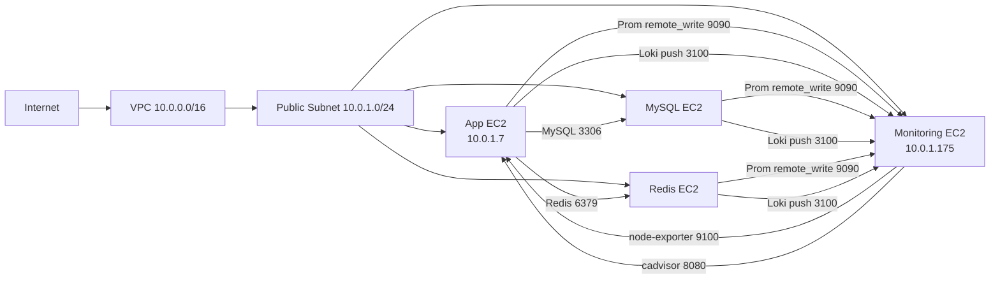

# Community Cloud V1 Infra (Terraform 기준)

이 문서는 `/Users/kimsj/kakao-tech/community/community-CLOUD/V1/terraform` 정의를 기준으로 V1 인프라 구성을 정리한 문서다.

## 목적

- V1 인프라 리소스 구성 한눈에 보기
- 앱 서버 / 모니터링 서버 / MySQL 서버 / Redis 서버 네트워크 관계 정리
- Alloy/Prometheus/Loki 통신 경로 점검 기준 정리
- 운영 중 드리프트 방지용 기준 문서로 사용

## Terraform 범위 (V1)

관리 대상 리소스:

- VPC 1개
- Public Subnet 1개 (단일 AZ)
- Internet Gateway / Public Route Table
- EC2 4대
  - App
  - Monitoring
  - MySQL
  - Redis
- Security Group 3개 + SG Rule 일부 동적 생성
- S3 Bucket 1개
- ECR Repository 2개 (backend, frontend)
- App/Monitoring/MySQL/Redis 공용 EC2 IAM Role + Instance Profile
- GitHub Actions 배포용 IAM User + Access Key

## 목표 구성 요약

기본값 / tfvars 기준:

- Region: `ap-northeast-2`
- AZ: `ap-northeast-2a`
- VPC CIDR: `10.0.0.0/16`
- Public Subnet CIDR: `10.0.1.0/24`
- 인스턴스 타입: 모두 `t4g.small`
- AMI: Ubuntu 24.04 ARM64 (`ami-04f06fb5ae9dcc778`)

생성 대상 인스턴스:

- App EC2
- Monitoring EC2
- MySQL EC2
- Redis EC2

## 네트워크 구조

단일 퍼블릭 서브넷에 4대 EC2가 모두 배치된다.



## Security Group 정책 (Terraform 정의 기준)

### App SG (`community-v1-app-sg`)

허용 인바운드:

- `80/tcp` from `app_ingress_cidr` (현재 tfvars: `0.0.0.0/0`)
- `443/tcp` from `app_ingress_cidr` (현재 tfvars: `0.0.0.0/0`)
- `8080/tcp` from `app_ingress_cidr` (현재 tfvars: `0.0.0.0/0`)
- `22/tcp` from `ssh_ingress_cidr` (현재 tfvars: `0.0.0.0/0`)
- `9100/tcp` from Monitoring SG (추가 rule)
- `8080/tcp` from Monitoring SG (추가 rule, cadvisor 용도)

주의:

- `8080`이 외부 전체 공개 + 모니터링 SG 허용 둘 다 존재한다.
- 백엔드 WAS(8080)와 cAdvisor(8080)를 같은 App EC2에서 동시에 외부 publish하면 충돌 가능성이 있으므로 실제 포트 배치 확인 필요.

### Monitoring SG (`community-v1-monitoring-sg`)

허용 인바운드:

- `22/tcp` from `ssh_ingress_cidr`
- `3000/tcp` from `monitoring_ingress_cidr` (Grafana)
- `9090/tcp` from `monitoring_ingress_cidr` (Prometheus)
- `9090/tcp` from App SG (추가 rule, remote write)
- `9090/tcp` from DB SG (추가 rule, remote write)
- `3100/tcp` from App SG (추가 rule, Loki ingest)
- `3100/tcp` from DB SG (추가 rule, Loki ingest)

### DB SG (`community-v1-db-sg`)

허용 인바운드:

- `22/tcp` from `ssh_ingress_cidr`
- `3306/tcp` from `db_ingress_cidr`
- `3306/tcp` from App EC2 Private IP (Terraform 동적 rule)
- `6379/tcp` from App EC2 Private IP (Terraform 동적 rule)

이 SG는 MySQL EC2와 Redis EC2에 공용으로 연결된다.

## IAM / 배포 관련 리소스

### EC2 IAM Role (공용)

- Role: `community-v1-app-ec2-role`
- Instance Profile: `community-v1-app-instance-profile`
- App/Monitoring/MySQL/Redis 인스턴스 모두 동일 프로파일 사용

부여 정책:

- S3 버킷(`jongju-mate-clay`) 객체 RW + 버킷 조회
- `AmazonEC2ContainerRegistryReadOnly`
- `AmazonSSMManagedInstanceCore`

### 배포용 IAM User

- User: `community-deployer`
- 용도: GitHub Actions에서 ECR Push + SSM Command 실행

권한 요약:

- ECR 로그인 / 이미지 Push
- SSM `SendCommand`, 결과 조회

주의:

- `terraform.tfstate`에는 배포용 access key secret 이 포함될 수 있으므로 저장/백업/권한 관리 필요
- 문서에는 민감값을 기록하지 않는다

## App / Monitoring 관측 경로 (Alloy 기준)

현재 V1 운영 구조에서 Alloy는 App 서버, MySQL 서버, Redis 서버에서 동작하며, 모니터링 서버로 메트릭/로그를 전송한다.

필수 연결 경로:

1. App EC2 내부(또는 같은 Docker 네트워크)
- Alloy -> Backend WAS `/api/actuator/prometheus`

2. App EC2 / MySQL EC2 / Redis EC2 -> Monitoring EC2
- Alloy -> Prometheus remote write: `http://<MONITORING_PRIVATE_IP>:9090/api/v1/write`
- Alloy -> Loki write: `http://<MONITORING_PRIVATE_IP>:3100/loki/api/v1/push`

3. 각 EC2 내부
- MySQL Alloy -> `mysqld-exporter`, `node-exporter`, `cadvisor`
- Redis Alloy -> `redis-exporter`, `node-exporter`, `cadvisor`
- App Alloy -> `Backend`, `node-exporter`, `cadvisor`

4. Monitoring EC2 -> App EC2 (선택/추가 exporter 운영 시)
- Prometheus -> App node-exporter `:9100`
- Prometheus -> App cAdvisor `:8080`

핵심 정리:

- Alloy는 "로컬 exporter/WAS 확인"과 "모니터링 서버 전송"이 둘 다 필요하다.
- 즉 App 서버, MySQL 서버, Redis 서버, Monitoring 서버 간 연결이 살아 있어야 전체 관측 파이프라인이 정상 동작한다.

## 운영 점검 체크리스트 (문제 발생 시)

### 1) App 서버에서 Backend 메트릭 확인

```bash
curl -sS -o /dev/null -w "%{http_code}\n" http://backend:8080/api/actuator/prometheus
```

또는 backend가 host 프로세스면:

```bash
curl -sS -o /dev/null -w "%{http_code}\n" http://host.docker.internal:8080/api/actuator/prometheus
```

### 2) App 서버에서 Monitoring 서버 연결 확인

```bash
curl -sS -o /dev/null -w "%{http_code}\n" http://10.0.1.175:9090/-/ready
curl -sS -o /dev/null -w "%{http_code}\n" http://10.0.1.175:3100/ready
```

### 3) Alloy 환경값 확인 (App EC2)

필수 값:

- `ALLOY_SPRING_TARGET`
- `PROM_REMOTE_WRITE_URL`
- `LOKI_WRITE_URL`
- `ALLOY_INSTANCE`

### 4) 모니터링 서버에서 확인

- Grafana: `http://54.180.239.181:3000`
- Prometheus: `http://54.180.239.181:9090`
- Prometheus query: `up{job="spring-backend"}`

## Terraform 파일 기준 참고 경로

- Terraform 정의: `/Users/kimsj/kakao-tech/community/community-CLOUD/V1/terraform/main.tf`
- 변수 정의: `/Users/kimsj/kakao-tech/community/community-CLOUD/V1/terraform/variables.tf`
- 운영 변수 예시: `/Users/kimsj/kakao-tech/community/community-CLOUD/V1/terraform/prod.tfvars`
- 출력값 정의: `/Users/kimsj/kakao-tech/community/community-CLOUD/V1/terraform/outputs.tf`
- App Alloy 설정: `/Users/kimsj/kakao-tech/community/community-CLOUD/V1/docker/app/alloy/config.alloy`
- Monitoring Compose: `/Users/kimsj/kakao-tech/community/community-CLOUD/V1/docker/monitoring/docker-compose.yml`

## 다음 정리 후보 (권장)

- `V1/deploy/compose/` 디렉토리로 app/alloy compose 분리
- 모니터링/앱 SG CIDR 최소화 (`0.0.0.0/0` 축소)
- backend/frontend 이미지 태그를 `latest` 대신 commit SHA 또는 digest로 고정
- `terraform.tfstate` 로컬 파일 대신 remote backend(S3 + DynamoDB lock) 사용
