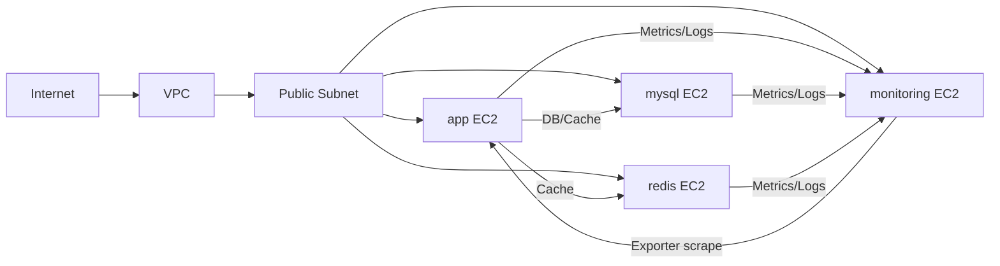

# Community Cloud V1 Infra (Public)

이 문서는 V1 Terraform 구성을 공개 가능한 수준으로 요약한 문서다.
민감정보(개인 경로, 개인 IP, 계정 식별자, 비밀값)는 제외했다.

## 1. 구성 범위

- VPC 1개
- Public Subnet 1개 (단일 AZ)
- Internet Gateway + Public Route Table
- EC2 4대 (app, monitoring, mysql, redis)
- Security Group 3개 + 인스턴스 간 추가 SG Rule
- S3 Bucket 1개
- ECR Repository 2개 (backend, frontend)
- EC2 공용 IAM Role/Instance Profile
- 배포용 IAM 사용자 1개

## 2. 네트워크 구조

모든 인스턴스는 동일 VPC/서브넷에 위치하며, 외부 통신이 가능한 구조다.

## 3. 보안 정책 요약

### App SG

- 인바운드: `80`, `443`, `8080`, `22`
- 모니터링 수집용 포트 허용: `9100`, `8080` (source: monitoring SG)

### Monitoring SG

- 인바운드: `22`, `3000`, `9090`
- app/db SG에서 `9090`, `3100` 허용 (remote write / Loki ingest)

### DB SG

- 인바운드: `22`, `3306`
- app EC2 private IP 기준으로 `3306`, `6379` 추가 허용
- mysql/redis 인스턴스가 동일 SG를 공유

## 4. IAM / 배포

- EC2 4대는 동일 Instance Profile을 사용
- EC2 Role 권한:
  - S3 버킷 조회/객체 RW
  - ECR ReadOnly
  - SSM Managed Instance Core
- 배포 IAM 사용자는 ECR push 및 SSM 명령 실행 권한 보유

## 5. 모니터링 연동

- app/mysql/redis 서버 Alloy -> monitoring 서버
  - Prometheus remote_write (`9090`)
  - Loki push (`3100`)
- monitoring 서버 -> app exporter 수집
  - node-exporter (`9100`)
  - cadvisor (`8080`)

## 6. 공개 문서 제외 항목

아래 항목은 본 공개 문서에서 제거됨:

- 개인 계정/사용자명/로컬 절대 경로
- 고정 공인 IP 및 개인 식별 가능 CIDR
- 버킷/리소스의 실제 운영 식별자
- 접근키/시크릿 등 민감 credential 값

## 7. 코드 기준 경로 (상대 경로)

- `V1/terraform/main.tf`
- `V1/terraform/variables.tf`
- `V1/terraform/prod.tfvars`
- `V1/terraform/outputs.tf`
